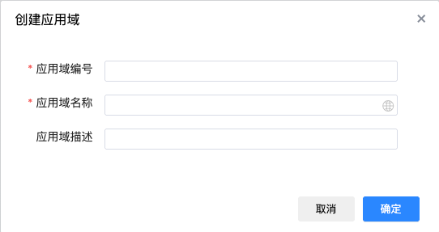

# 在AppDomainNavigation的底部增加创建应用域和模块的按钮

## 关于名词
- 应用域：AppDomain
- 模块：Module
- 业务对象：BusinessObject，系统在数据库存储时统一用业务对象存储数据，根据层级不同，在界面层面被映射为不同的概念。layer为1的为产品，layer为2的为应用域，layer为3的为模块，layer为4的为应用。

## 业务对象的API
统一使用这个API获取业务对象，并根据层级筛选应用域、模块、应用等产品概念
http://localhost:5200/api/runtime/sys/v1.0/business-objects/

通过GET请求获取数据，通过POST请求创建数据

## 创建关键应用时提交的数据结构
创建关键应用时，parentID默认为系统中已经存在的顶级数据gscloud。
按下面的格式组织JSON数据，用Post请求调用业务对象API创建数据。
其中code、name、languageName对象下的zh-CHS的值来源于界面输入。
id为随机生成数据
```JSON
{"code":"Case01","name":"Case01","languageName":{"zh-CHS":"Case01"},"description":"Case01","id":"36247519-e2e8-82fb-fa1e-db988b189ade","layer":2,"parentID":"gscloud","sysInit":"0","isSysInit":false,"isDetail":"0","sortOrder":39}
```

## 创建模块时提交的数据结构
创建关键应用时，parentID为当前选中的关键应用的id。
按下面的格式组织JSON数据，用Post请求调用业务对象API创建数据。
其中code、name、languageName对象下的zh-CHS的值来源于界面输入。
id为随机生成数据
```JSON
{"code":"Module01InCase01","name":"Module01InCase01","languageName":{"zh-CHS":"Module01InCase01"},"id":"de27a49b-ff5c-4b36-5db1-b7d009bec8b5","layer":3,"parentID":"36247519-e2e8-82fb-fa1e-db988b189ade","sysInit":"0","isSysInit":false,"isDetail":"0","sortOrder":1}
```

## 创建应用域和模块的按钮
参考，创建应用域和模块的按钮在AppDomainNavigation的底部。

## 创建关键应用的弹出窗口
在创建应用域和模块的按钮的点击事件中，弹出一个弹出窗口，用于输入应用域和模块的名称。
界面参考

## 创建模块的弹出窗口
在创建模块的按钮的点击事件中，弹出一个弹出窗口，用于输入模块的名称。
界面参考