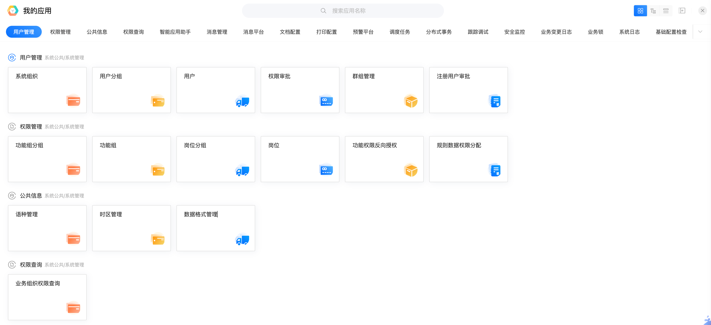

# 实现应用中心

## 示例界面




## 1. 加载业务对象数据

- API

http://localhost:5200/api/dev/main/v1.0/business-objects

- 返回值
包含layer 1～4的完整业务对象数据

## 2. 构建应用导航

应用导航的第一级为layer为2的关键应用，导航的二级分组为layer为3的模块，可点击图标为layer为4的业务对象。
开发建模的业务对象，对终端用户表现为应用。

加载处理完整业务对象数据的逻辑可以参考已有实现：
```
packages/ide/apps/platform/development-platform/ide/app-builder/src/composition/use-menu-data.ts
```

## 3. 打开应用门户

点击应用图片，联查打开应用预览页面，预览页面参考系统中已有实现：
```
packages/ide/apps/platform/development-platform/ide/app-preview
```
