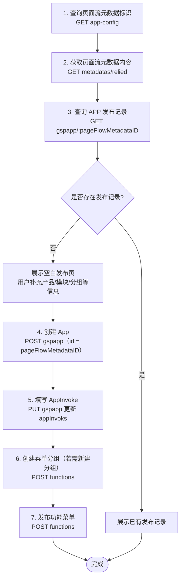

# 实现发布菜单功能

## 示例界面


## 执行流程

页面流元数据（`.pf`）映射为系统功能入口：先解析可发布路由，再落库 App、AppInvoke，最后挂到菜单分组并发布功能菜单。



## 1. 查询工程内页面流元数据标识

应用工程内以扩展名为`.pf`的页面流元数据定义应用内的页面路由信息。可以对外发布作为功能入口的页面，会被添加入页面流元数据的路由列表中。
应用发布过程是将页面流元数据映射为系统功能入口的过程。
发布前需要通过GET请求获取页面流元数据，并判断是否已经存在该元数据的发布记录。

- API
http://localhost:5200/api/dev/main/v1.0/app-config?projectPath=Cases/Referencies/ReferenceApp/bo-referenceapp-front/metadata

- 参数
```
?projectPath=Cases/Referencies/ReferenceApp/bo-referenceapp-front/metadata
```

- 返回值
```JSON
{
    "pageFlowMetadataID": "2dca6f3c-4a06-4f64-aa79-5b6581c1db4b",
    "pageFlowMetadataFileName": "predefinePageflow.pf",
    "pageFlowMetadataPath": "metadata/route/predefinePageflow.pf",
    "mobilePageFlowMetadataID": null,
    "mobilePageFlowMetadataFileName": null,
    "mobilePageFlowMetadataPath": null
}
```

## 2. 获取页面流元数据内容

查询到页面流元数据标识后，可以调用获取元数据的API查询页面流元数据内容。
页面流元数据的content节点保存发布的路由信息，包含在路由列表中的页面可以发布为功能入口。

- API 
http://localhost:5200/api/dev/main/v1.0/metadatas/relied?metadataPath=Cases/Referencies/ReferenceApp/bo-referenceapp-front/metadata/components&metadataID=2dca6f3c-4a06-4f64-aa79-5b6581c1db4b

- 参数
```
?metadataPath=Cases/Referencies/ReferenceApp/bo-referenceapp-front/metadata/components&metadataID=2dca6f3c-4a06-4f64-aa79-5b6581c1db4b
```

- 返回值
```JSON
{
    "id": "2dca6f3c-4a06-4f64-aa79-5b6581c1db4b",
    "nameSpace": "Inspur.GS.Cases.Referencies.ReferenceApp.ReferenceApp.Front",
    "code": "predefinePageflow",
    "name": "predefinePageflow",
    "fileName": "predefinePageflow.pf",
    "type": "PageFlowMetadata",
    "bizobjectID": "541ef6bb-58d0-e623-1f27-bf5d209bdf5c",
    "language": "zh-CHS",
    "isTranslating": false,
    "relativePath": "Cases/Referencies/ReferenceApp/bo-referenceapp-front/metadata/route",
    "extendProperty": "",
    "content": "{\n  \"code\" : null,\n  \"name\" : null,\n  \"id\" : \"2dca6f3c-4a06-4f64-aa79-5b6581c1db4b\",\n  \"project\" : {\n    \"name\" : \"bo-referenceapp-front\"\n  },\n  \"pages\" : [ {\n    \"id\" : \"10bdf313-7a69-4fa5-a0c5-2be50914975c\",\n    \"code\" : \"ProjectCard\",\n    \"name\" : \"项目卡片\",\n    \"fileName\" : \"ProjectCard.frm\",\n    \"relativePath\" : \"Cases/Referencies/ReferenceApp/bo-referenceapp-front/metadata/components\",\n    \"formUri\" : null,\n    \"routeUri\" : \"ProjectCard\",\n    \"routeParams\" : null\n  }, {\n    \"id\" : \"f7fa51ee-0902-4aca-a006-0037a86bef1d\",\n    \"code\" : \"ProjectCardV\",\n    \"name\" : \"项目卡片V\",\n    \"fileName\" : \"ProjectCardV.frm\",\n    \"relativePath\" : \"Cases/Referencies/ReferenceApp/bo-referenceapp-front/metadata/components\",\n    \"formUri\" : \"f7fa51ee-0902-4aca-a006-0037a86bef1d\",\n    \"routeUri\" : \"ProjectCardV\",\n    \"routeParams\" : null\n  } ],\n  \"entry\" : \"ProjectCard\",\n  \"routes\" : null,\n  \"appCode\" : null,\n  \"appName\" : null,\n  \"publishes\" : null\n}",
    "extendable": false,
    "refs": null,
    "extented": false,
    "previousVersion": null,
    "version": null,
    "properties": null,
    "extendRule": null,
    "projectName": null,
    "processMode": null,
    "mdsha1": null,
    "createdOn": null,
    "lastChangedOn": null,
    "lastChangedBy": null,
    "mdpkgId": null,
    "nameLanguage": null,
    "translating": false
}
```

## 3. 查询APP发布记录

APP发布记录的标识为页面流元数据标识，可以使用此标识查询是否存在发布记录，如果存在则展示发布记录，不存在则展示空记录。

- API 
http://localhost:5200/api/runtime/sys/v1.0/gspapp/2dca6f3c-4a06-4f64-aa79-5b6581c1db4b

- 参数
- 返回值
空

## 4. 创建App发布记录

如果系统中不存在APP发布记录，系统展示空白发布页面，由用户补充相关信息发布具体页面。
展示发布页面时，可以根据当前应用的业务对象标识(boId)向上查找layer为2的关键应用，layer为3的模块信息，
系统展示空白的菜单分组输入框，用户输入菜单分组后，系统先调用创建菜单分组API创建并回写菜单分组标识，再发布功能菜单。

通过POST请求创建App
以*pageFlowMetadataID*作为发布App的标识

- API
http://localhost:5200/api/runtime/sys/v1.0/gspapp

- 参数

```JSON
{
    "id": "2dca6f3c-4a06-4f64-aa79-5b6581c1db4b",
    "code": "ProjectCardAngular",
    "name": "项目卡片",
    "nameLanguage": {
        "zh-CHS": "项目卡片"
    },
    "layer": 4,
    "url": "/apps/cases/referencies/web/bo-referenceapp-front/index.html",
    "bizObjectId": "541ef6bb-58d0-e623-1f27-bf5d209bdf5c",
    "appInvoks": [],
    "parentId": "0"
}
```

- 返回值

```
true
```

## 5. 向APP中填写APPInvoke记录
AppInvok记录对应系统中的菜单发布记录，用户点击确定发布菜单时，系统先创建APP发布记录，再根据页面信息补充APP Invoke记录，最后发布菜单
通过PUT请求更新appInvoks信息

- API
http://localhost:5200/api/runtime/sys/v1.0/gspapp

- 参数

```JSON
{
    "id": "2dca6f3c-4a06-4f64-aa79-5b6581c1db4b",
    "code": "ProjectCardAngular",
    "name": "项目卡片",
    "nameLanguage": {
        "zh-CHS": "项目卡片"
    },
    "layer": 4,
    "url": "/apps/cases/referencies/web/bo-referenceapp-front/index.html",
    "bizObjectId": "541ef6bb-58d0-e623-1f27-bf5d209bdf5c",
    "appInvoks": [
        {
            "appEntrance": "ProjectCard",
            "appId": "2dca6f3c-4a06-4f64-aa79-5b6581c1db4b",
            "code": "ProjectCard",
            "id": "dbfc05bf-960c-4227-b08c-f1c2ea455de8",
            "name": "项目卡片"
        }
    ],
    "parentId": "0"
}
```

- 返回值
```
true
```

## 6. 创建菜单分组

POST请求创建菜单分组

- API 
http://localhost:5200/api/runtime/sys/v1.0/functions

- 参数
```JSON
{
    "id": "2cebfdfb-3edd-4bf5-8a29-2dbe3956ae77",
    "parentId": "5dd97fc6-79e5-9b5b-9e73-ef365e103a05",
    "code": "DemoApp",
    "funcType": "3",
    "isDetail": true,
    "isSysInit": false,
    "layer": "3",
    "menuType": "0",
    "name": "示例应用",
    "nameLanguage": {
        "zh-CHS": "示例应用"
    },
    "description": ""
}
```


## 7. 发布功能菜单

- API
http://localhost:5200/api/runtime/sys/v1.0/functions

- 参数
```JSON
{
    "productId": "fb0ccb7b-b917-d0d4-0af2-95ad026ebaf3",
    "moduleId": "5dd97fc6-79e5-9b5b-9e73-ef365e103a05",
    "groupId": "2cebfdfb-3edd-4bf5-8a29-2dbe3956ae77",
    "appId": "2dca6f3c-4a06-4f64-aa79-5b6581c1db4b",
    "appInvokId": "dbfc05bf-960c-4227-b08c-f1c2ea455de8",
    "bizObjectId": "BO",
    "bizOpId": "BOManager",
    "id": "7b123f0c-2f1c-464c-aea1-c28d0469aadf",
    "code": "ProjectCard",
    "name": "项目卡片",
    "nameLanguage": {
        "en": "ProjectCard",
        "zh-CHS": "项目卡片",
        "zh-CHT": ""
    },
    "creator": "",
    "description": "",
    "funcType": "4",
    "icon": "",
    "isDetail": true,
    "isDisplayed": true,
    "isSysInit": false,
    "layer": "4",
    "menuType": "SysMenu",
    "parentId": "2cebfdfb-3edd-4bf5-8a29-2dbe3956ae77",
    "path": "",
    "staticParams": "[]",
    "url": "",
    "invokeMode": "invokeapp",
    "bizOpCode": "BOManager"
}
```

- 返回值
```
true
```