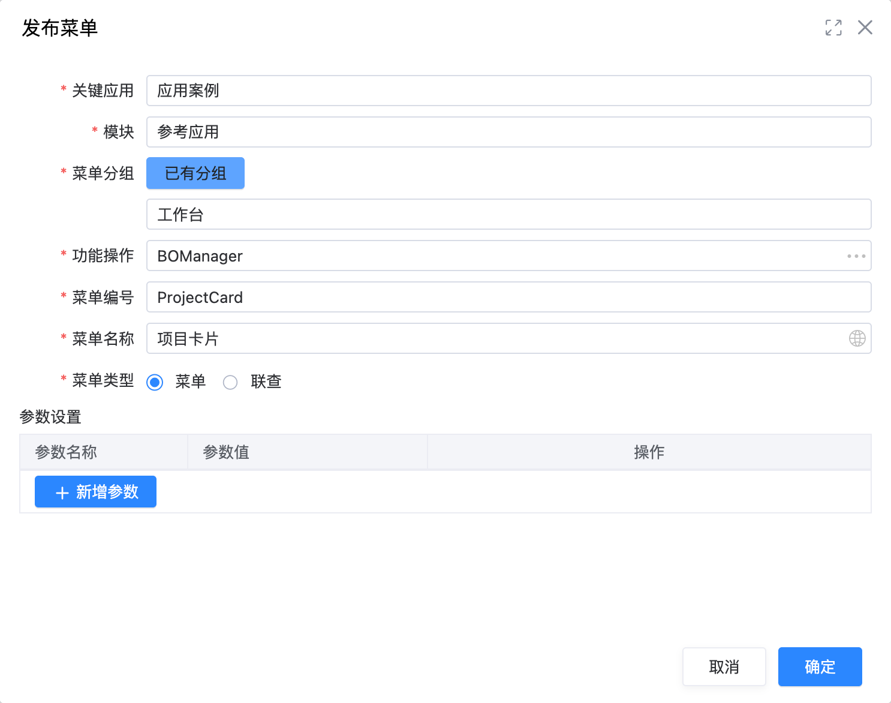
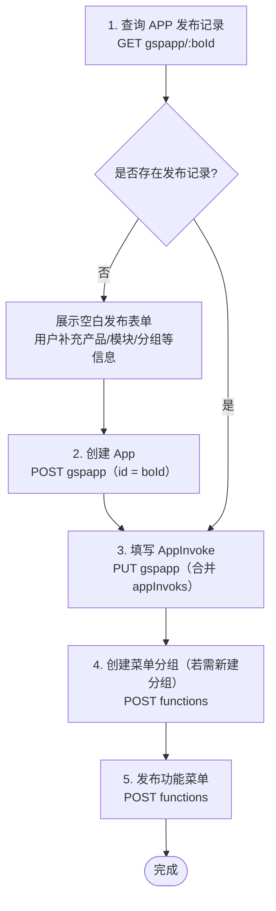

# 实现发布菜单功能

## 示例界面



## 执行流程（与当前 app-builder 实现一致）

应用构建器中的「发布菜单」以**当前工作区的业务对象标识（`boId`）**作为 App 在运行时系统中的主键：先查询是否已有 App 发布记录，再按需创建 App、合并写入 AppInvoke、处理菜单分组，最后发布功能菜单项。

**说明：** 发布链路内**不再**调用「查询页面流元数据标识（`app-config`）」与「获取页面流元数据内容（`metadatas/relied`）」；菜单管理页左侧以 Form 元数据为摘要列表，右侧表单与发布编排由 `use-publish.composition.ts` 中的 `publishMenu` / `collectPublishMenuExecutionParams` 完成。



### 代码入口

- 组合式 API：`packages/ide/apps/platform/development-platform/ide/app-builder/src/components/function-board/use-publish.composition.ts`
- 归集参数：`collectPublishMenuExecutionParams()`（仅执行步骤 1 并组装 `PublishMenuExecutionParams`）
- 完整发布：`publishMenu()`（步骤 1～5，其中步骤 2 仅当无 App 记录时执行）

---

## 1. 查询 APP 发布记录

使用**业务对象标识**作为 App 记录主键，判断当前业务对象是否已有对应 App 发布数据；有则进入「已有记录」分支（仍可能需补充 AppInvoke 与菜单发布），无则进入创建 App 分支。

- API  
  `GET /api/runtime/sys/v1.0/gspapp/{boId}`

- 路径参数  
  `{boId}`：当前应用工作区注入的业务对象 ID（与 `POST/PUT gspapp` 的 `id`、`appInvoks[].appId` 及发布菜单请求体中的 `appId` 保持一致）。

- 返回值  
  无记录时多为空响应或 404（实现侧按「无 `id`」视为无记录）；有记录时为 App 对象 JSON（含 `appInvoks` 等）。

---

## 2. 创建 App 发布记录（无记录时）

若步骤 1 判定不存在 App 记录，由用户在前端表单补充产品、模块、菜单分组等信息后，点击「发布」触发创建。

通过 `POST` 创建 App，**`id` 与业务对象标识一致**（即 `boId`）。

- API  
  `POST /api/runtime/sys/v1.0/gspapp`

- 参数示例

```JSON
{
    "id": "<boId>",
    "code": "ProjectCard",
    "name": "项目卡片",
    "nameLanguage": {
        "zh-CHS": "项目卡片"
    },
    "layer": 4,
    "url": "/apps/<应用路径>/index.html",
    "bizObjectId": "<boId>",
    "appInvoks": [],
    "parentId": "0"
}
```

- 返回值  

```
true
```

---

## 3. 向 APP 中填写 AppInvoke 记录

AppInvoke 对应可发布的页面入口。实现侧在 `PUT gspapp` 时**在已有 `appInvoks` 上按当前入口 `code` 合并或追加**，避免覆盖同一 App 下其它已发布入口。

- API  
  `PUT /api/runtime/sys/v1.0/gspapp`

- 参数要点  

  - `id`：与 `boId` 相同。  
  - `appInvoks`：包含当前页面对应的 invoke（`appEntrance` / `code` 与页面路由或表单入口一致）。  

- 返回值  

```
true
```

---

## 4. 创建菜单分组（若需新建分组）

用户选择「新建分组」并填写分组名称时，先调用创建菜单分组接口，回写分组 `id` 后再执行步骤 5。

- API  
  `POST /api/runtime/sys/v1.0/functions`

- 参数示例（`funcType` 为分组）

```JSON
{
    "id": "2cebfdfb-3edd-4bf5-8a29-2dbe3956ae77",
    "parentId": "<moduleId>",
    "code": "DemoApp",
    "funcType": "3",
    "isDetail": true,
    "isSysInit": false,
    "layer": "3",
    "menuType": "0",
    "name": "示例应用",
    "nameLanguage": {
        "zh-CHS": "示例应用"
    },
    "description": ""
}
```

---

## 5. 发布功能菜单

将菜单项挂到指定分组下，并与 App、AppInvoke 建立关联。

- API  
  `POST /api/runtime/sys/v1.0/functions`

- 参数要点  

  - `appId`：与 `boId` 一致。  
  - `bizObjectId`：当前实现使用**工作区业务对象 ID**（与占位符 `BO` 的示例不同，以代码为准）。  
  - `appInvokId`：步骤 3 中当前入口对应的 invoke `id`。  
  - `productId` / `moduleId` / `groupId`：来自表单或祖先解析（菜单卡片中「关键应用」「模块」等）。  

- 参数示例

```JSON
{
    "productId": "fb0ccb7b-b917-d0d4-0af2-95ad026ebaf3",
    "moduleId": "5dd97fc6-79e5-9b5b-9e73-ef365e103a05",
    "groupId": "2cebfdfb-3edd-4bf5-8a29-2dbe3956ae77",
    "appId": "<boId>",
    "appInvokId": "dbfc05bf-960c-4227-b08c-f1c2ea455de8",
    "bizObjectId": "<boId>",
    "bizOpId": "BOManager",
    "id": "7b123f0c-2f1c-464c-aea1-c28d0469aadf",
    "code": "ProjectCard",
    "name": "项目卡片",
    "nameLanguage": {
        "en": "ProjectCard",
        "zh-CHS": "项目卡片",
        "zh-CHT": ""
    },
    "creator": "",
    "description": "",
    "funcType": "4",
    "icon": "",
    "isDetail": true,
    "isDisplayed": true,
    "isSysInit": false,
    "layer": "4",
    "menuType": "SysMenu",
    "parentId": "2cebfdfb-3edd-4bf5-8a29-2dbe3956ae77",
    "path": "",
    "staticParams": "[]",
    "url": "",
    "invokeMode": "invokeapp",
    "bizOpCode": "BOManager"
}
```

- 返回值  

```
true
```

---

## 附录：页面流元数据 API（背景说明）

以下接口仍可用于**从页面流（`.pf`）解析可发布路由**等场景（例如功能板中列举页面流 `pages`），但**已不作为菜单发布主链路的前置步骤**；App 主键以业务对象 `boId` 为准。

### A.1 查询工程内页面流元数据标识

- API  
  `GET /api/dev/main/v1.0/app-config?projectPath=<...>/metadata`

- 返回值字段示例：`pageFlowMetadataID`、`pageFlowMetadataFileName`、`pageFlowMetadataPath`

### A.2 获取页面流元数据内容

- API  
  `GET /api/dev/main/v1.0/metadatas/relied?metadataPath=<...>/metadata/components&metadataID=<pageFlowMetadataID>`

- 说明：`content` 中的 `pages` 列表描述可发布为功能入口的页面；与以 `boId` 为主键的 `gspapp` 模型相互独立，按产品需求选用。
